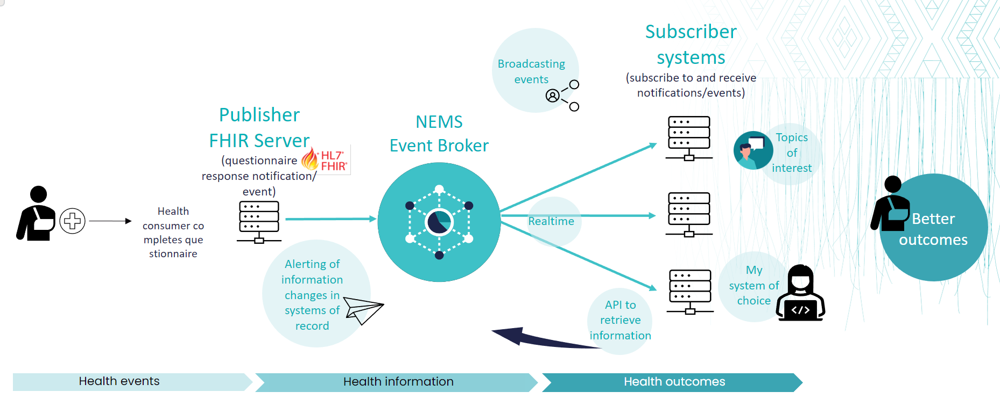
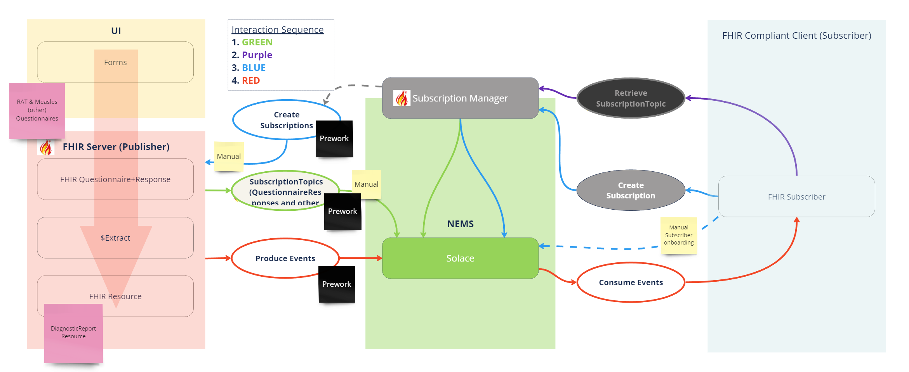
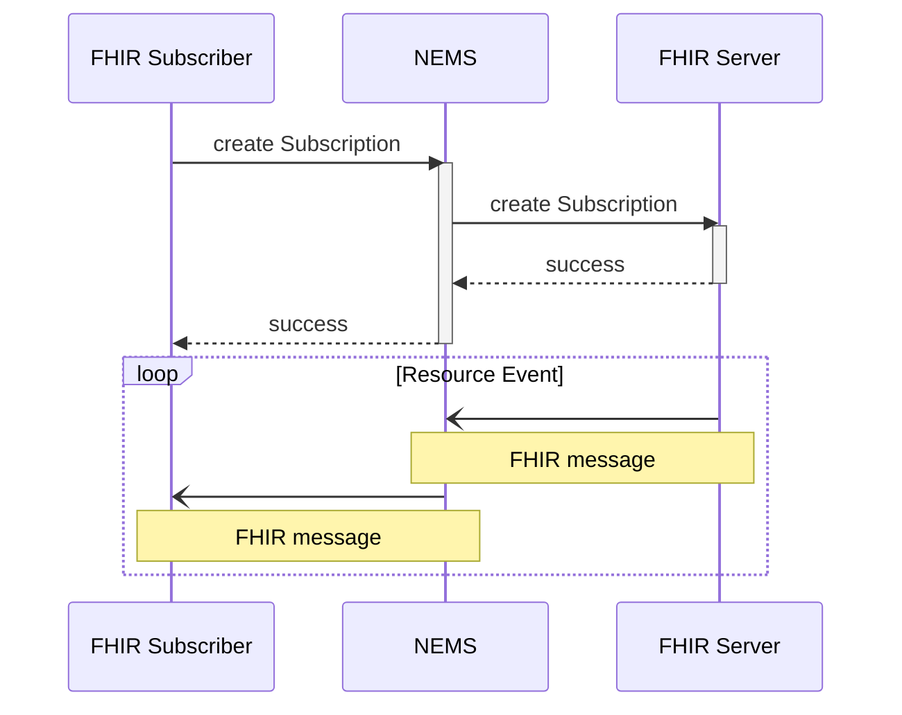

# Ring of FHIR - Connectathon March 2024 - NEMS Track

## About NEMS (National Event Management Service) - TLDR; 
> **What if we could get the right data to the right people in the right place at the right time……**

> **What if we could decouple publishers of event information from the subscribers……**

* The National Event Management Service or NEMS will be a national Health NZ-owned event driven architecture solution supporting health sector interoperability. 

* NEMS acts as an event broker to send notifications to other systems who have registered an interest in a change event in a source system. 

* In this context an event is a change of data in any one system that might prompt a notification and potentially trigger a process in another system. We can also consider these “Event Topics". 

* Event topic examples: Patient admission to hospital, changes to a providers practicing certificate status or a change of address for a healthcare consumer.

[Learn more about NEMS](https://docs.google.com/viewer?url=https://confluence.hl7.org/download/attachments/220707922/National%20Event%20Management%20Service%20101%20Feb%202024.pdf?version=2&modificationDate=1710453339276&api=v2)

[Learn more about this track](https://confluence.hl7.org/pages/viewpage.action?pageId=220707922)

## NEMS Track and FHIR Questionnaires
The NEMS and FHIR Questionnaires tracks are combining to implement an end to end flow for a FHIR Subscription. We will work together with our participants skill sets and interests across 3 workstreams. Use Case > Design > Engineer.

We are developing a plan with pre-work to ensure we can work on each of these streams in parallel.

By integrating FHIR questionnaires with the National Event Management Service, healthcare providers could enhance data collection efficiency, improve care coordination, and enable more proactive and personalised patient care. For example, completing a questionnaire about symptoms could trigger an alert to a healthcare provider if certain responses indicate a high risk or require immediate attention.

The following diagram illustrates the flow of creating a FHIR Subscription and receiving a FHIR message with NEMS and underlying FHIR server:

### Get Started

This is the repo for the NEMS / Questionnaire stream for the Ring Of FHIR Connectathon. There are 2 simple subscriber applications written in Java and .NET. Depending on your comfort level you can choose the language of your choice. However the Java client application has more helper files to manage FHIR requests.

If you are a .NET enthusiast we encourage you to use the .NET example and build out the FHIR capability.

It is assumed that you have a level of developer experience, e.g. you know how to run a Java or .NET program from your PC. The sample code should be easy enough to install and run on your PC with no code changes.

### Installation Instructions

There are 2 folders in the repo.

1. [NEMSGuaranteedSubscriber-dotNET](https://github.com/tewhatuora/fhir-connectathon-march-2024/tree/main/NEMSGuaranteedSubscriber-dotNET) (for the .NET code)
2. [NEMSGuaranteedSubscriber](https://github.com/tewhatuora/fhir-connectathon-march-2024/tree/main/NEMSGuaranteedSubscriber) (for the Java Code)

When you download the repo you will have these 2 folders available.

#### Requirements:

- IDE of your choice
- Git (optional)

#### Git Option:

If you have git installed you can run the command below from the command line. This will create a folder fhir-connectathon-march-2024 in the same directory you ran the command from.

    git clone https://github.com/tewhatuora/fhir-connectathon-march-2024.git

#### Non Git Option:

If you want to keep it simple and download without Git installed. Go to the following link and click the green code dropdown. Choose Download Zip and unzip in a location of your choice.

#### Connection Details:

Before you can connect a user and queue needs to be established. This will be done at the connectathon. The NEMS team member will provide the credentials for you to connect your app.

Have Fun!
